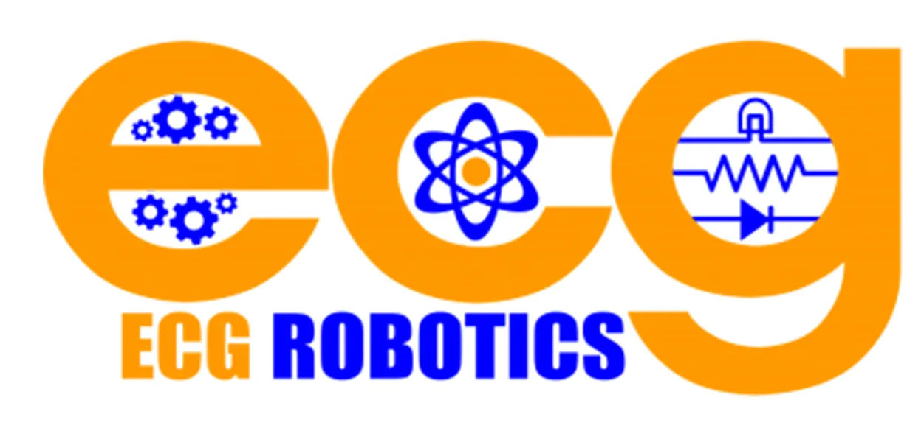

<!-- Improved compatibility of back to top link: See: https://github.com/othneildrew/Best-README-Template/pull/73 -->
<a id="readme-top"></a>
<!--
*** Thanks for checking out the Best-README-Template. If you have a suggestion
*** that would make this better, please fork the repo and create a pull request
*** or simply open an issue with the tag "enhancement".
*** Don't forget to give the project a star!
*** Thanks again! Now go create something AMAZING! :D
-->


<!-- PROJECT SHIELDS -->
<!--
*** I'm using markdown "reference style" links for readability.
*** Reference links are enclosed in brackets [ ] instead of parentheses ( ).
*** See the bottom of this document for the declaration of the reference variables
*** for contributors-url, forks-url, etc. This is an optional, concise syntax you may use.
*** https://www.markdownguide.org/basic-syntax/#reference-style-links
-->
[![Contributors][contributors-shield]][contributors-url]
[![Forks][forks-shield]][forks-url]
[![Stargazers][stars-shield]][stars-url]
[![Issues][issues-shield]][issues-url]
[![project_license][license-shield]][license-url]


<!-- PROJECT LOGO -->
<br />
<div align="center">
  <a href="https://github.com/kevalshah2005/ecgrobotics.org">
    
  </a>

<h3 align="center">ECG Robotics Website</h3>

  <p align="center">
    Welcome to the official ECG Robotics website repository! Here you can find all of the code for the ECG Robotics website.
    <br />
    <br />
    <a href="https://ecgrobotics.org">View Website</a>
    &middot;
    <a href="https://github.com/kevalshah2005/ecgrobotics.org/issues/new?labels=bug&template=bug_report.md">Report Bug</a>
    &middot;
    <a href="https://github.com/kevalshah2005/ecgrobotics.org/issues/new?labels=enhancement&template=feature_request.md">Request Feature</a>
</p>

</div>


<!-- TABLE OF CONTENTS -->
<details>
  <summary>Table of Contents</summary>
  <ol>
    <li>
      <a href="#about-the-project">About The Project</a>
      <ul>
        <li><a href="#built-with">Built With</a></li>
      </ul>
    </li>
    <li>
      <a href="#getting-started-with-contributing">Getting Started With Contributing</a>
      <ul>
        <li><a href="#prerequisites">Prerequisites</a></li>
        <li><a href="#installation">Installation</a></li>
      </ul>
    </li>
    <li><a href="#roadmap">Roadmap</a></li>
    <li><a href="#license">License</a></li>
    <li><a href="#contact">Contact</a></li>
    <li><a href="#acknowledgments">Acknowledgments</a></li>
  </ol>
</details>


<!-- ABOUT THE PROJECT -->
# About The Project

[![ECG Robotics Screen Shot][product-screenshot]](https://ecgrobotics.org)

This website is the overhaul of the old ECG Robotics website, which was outdated and made using Wordpress. This new version offers more customization options and allows students to gain skills in using real-world web development tools such as HTML/CSS and React.js.

<p align="right">(<a href="#readme-top">back to top</a>)</p>


## Built With

* [![React][React.js]][React-url]
* [![Vite][Vite]][Vite-url]
* [![npm][npm]][npm-url]

<p align="right">(<a href="#readme-top">back to top</a>)</p>


<!-- GETTING STARTED -->
# Getting Started with Contributing

To get a local copy up and running, follow these simple steps.

## Prerequisites

To contribute to this project, you need four essential tools:  

- **A GitHub account** - To fork the repository and submit changes
- **npm** – To manage project dependencies  
- **Git** – To push and pull changes  
- **A code editor** – To write and edit code (Visual Studio Code is recommended)  

Follow these steps to ensure you have everything set up:  

### 1. Create a GitHub Account  

If you don’t already have a GitHub account, create one by visiting [GitHub](https://github.com/) and signing up.  
You'll need this to fork the repository, submit pull requests, and collaborate on the project.  

### 2. Install npm  

First, check if npm is already installed by running:  
```sh
npm -v
```
If you see a version number, you're good to go! Otherwise, install npm by following the instructions on the [official npm repository][npm-installation-url].

### 3. Install Git  

Check if Git is installed by running:  
```sh
git -v
```  
If you see a version number, you’re good to go! Otherwise, install Git by visiting the [Git website](https://git-scm.com/) and following the installation instructions for your operating system.  

### 4. Install a Code Editor (Recommended: Visual Studio Code)  

While you can technically use any text editor, **Visual Studio Code (VS Code)** is highly recommended because of its powerful features like syntax highlighting, autocompletion, and an integrated terminal.

Check if VS Code is installed by running:
```sh
code -v
```
If you see a version number, you're good to go! Otherwise, to install VS Code, perform the following steps:
1. Go to the [VS Code download page](https://code.visualstudio.com/Download).  
2. Select your operating system (Windows, macOS, or Linux).  
3. Download and install it following the setup instructions.

#### Recommended VS Code Extensions  

For the best experience, install these extensions: 
- **GitHub Copilot** – An AI-powered coding assistant that helps write code faster. If you're a student, you can get **GitHub Copilot for free** through the [GitHub Student Developer Pack](https://education.github.com/pack).  
- **ES7+ React/Redux/React-Native snippets** – Provides useful shortcuts for React development, like `rfce` for function components and `useState` snippets.

---

Once you have **npm, Git, and VS Code** installed, you're ready to **clone the repository and start contributing**!


## Installation  

1. **Fork the repository** to create your own copy that you can make changes on. If you'd like to make changes to the website, you'll eventually make a pull request to request for your changes to be put on the website. 
2. **Open your terminal** and navigate to the folder that you want your project to be hosted in by running:
    ```sh
    cd <folder-path>
    ```
3. **Clone your forked repository** to your local machine by running the following command in your terminal (replace `<your-username>` with your GitHub username):  
   ```sh
   git clone https://github.com/<your-username>/<repository-name>.git
   ``` 
   This will download the project files to your computer.  

4. **Navigate into the project folder**:  
   ```sh
   cd <repository-name>
   ```  

5. **Install dependencies**: You'll need to install all required npm packages before running the project. Run:  
   ```sh
   npm install
   ```  
   This will download and set up all the necessary dependencies.  

6. **Start the development server**:  
   ```sh
   npm run dev
   ```  
   This will start the Vite development server, and you should see a local URL (e.g., `http://localhost:5173/`) where the website is running. Open this link in your browser to preview your changes live.  

7. **Make your changes**: Open the project folder in **Visual Studio Code (VS Code)** and start editing the files.  

8. **Commit and push your changes**:  
   - After making changes, stage them:  
     ```sh
     git add .
     ```  
   - Commit them with a message describing what you changed:  
     ```sh
     git commit -m "Your commit message here"
     ```  
   - Push your changes to your forked repository:  
     ```sh
     git push origin main
     ```  

9. **Submit a pull request**:
   - Go to your forked repository on GitHub.  
   - Click on the **"Contribute"** button and select **"Open Pull Request"**.  
   - Describe your changes and submit the pull request.  

Once your pull request is reviewed and approved, **your changes will be merged into the main project!**

## Top contributors:

<a href="https://github.com/kevalshah2005/ecgrobotics.org/graphs/contributors">
  
</a>

<p align="right">(<a href="#readme-top">back to top</a>)</p>


<!-- ROADMAP -->
# Roadmap

See the [open issues](https://github.com/kevalshah2005/ecgrobotics.org/issues) for a full list of proposed features (and known issues).

<p align="right">(<a href="#readme-top">back to top</a>)</p>


<!-- LICENSE -->
# License

Distributed under the [MIT License]([license_url]). See `LICENSE` for more information.

<p align="right">(<a href="#readme-top">back to top</a>)</p>


<!-- CONTACT -->
# Contact

Keval Shah - kevals2005@gmail.com

Project Link: [https://github.com/kevalshah2005/ecgrobotics.org](https://github.com/kevalshah2005/ecgrobotics.org)

<p align="right">(<a href="#readme-top">back to top</a>)</p>


<!-- ACKNOWLEDGMENTS -->
# Acknowledgments

* All the incredible ECG Robotics students, mentors, and parents. Without your work, this club wouldn't be possible!

<p align="right">(<a href="#readme-top">back to top</a>)</p>


<!-- MARKDOWN LINKS & IMAGES -->
<!-- https://www.markdownguide.org/basic-syntax/#reference-style-links -->
[contributors-shield]: https://img.shields.io/github/contributors/kevalshah2005/ecgrobotics.org.svg?style=for-the-badge
[contributors-url]: https://github.com/kevalshah2005/ecgrobotics.org/graphs/contributors
[forks-shield]: https://img.shields.io/github/forks/kevalshah2005/ecgrobotics.org.svg?style=for-the-badge
[forks-url]: https://github.com/kevalshah2005/ecgrobotics.org/network/members
[stars-shield]: https://img.shields.io/github/stars/kevalshah2005/ecgrobotics.org.svg?style=for-the-badge
[stars-url]: https://github.com/kevalshah2005/ecgrobotics.org/stargazers
[issues-shield]: https://img.shields.io/github/issues/kevalshah2005/ecgrobotics.org.svg?style=for-the-badge
[issues-url]: https://github.com/kevalshah2005/ecgrobotics.org/issues
[license-shield]: https://img.shields.io/github/license/kevalshah2005/ecgrobotics.org.svg?style=for-the-badge
[license-url]: https://github.com/kevalshah2005/ecgrobotics.org/blob/main/LICENSE
[product-screenshot]: readme_media/landing.png
[React.js]: https://img.shields.io/badge/React-20232A?style=for-the-badge&logo=react&logoColor=61DAFB
[React-url]: https://reactjs.org/
[Vite]: https://img.shields.io/badge/Vite-20232A?style=for-the-badge&logo=vite
[Vite-url]: https://vite.dev
[npm]: https://img.shields.io/badge/npm-20232A?style=for-the-badge&logo=npm&logoColor=CB3837
[npm-url]: https://www.npmjs.com/
[npm-installation-url]: https://github.com/nvm-sh/nvm
[bug-issue-url]: https://github.com/kevalshah2005/ecgrobotics.org/issues/new?labels=bug&template=bug_report.md
[feature-issue-url]: https://github.com/kevalshah2005/ecgrobotics.org/issues/new?labels=enhancement&template=feature_request.md
